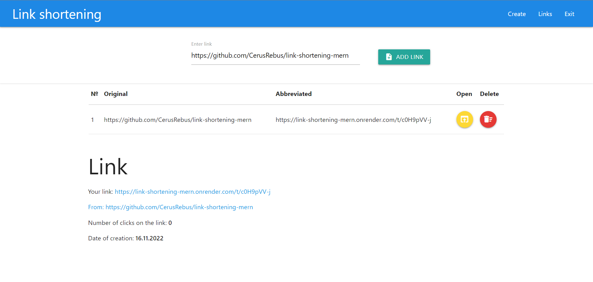

# <a id="up">__Link shortening project__</a>

 

___
> This project is made using the MERN stack.
[Link to work page](https://cerusrebus.github.io/links)

The following functionality has been implemented on the project:
- [x] new user registration
- [x] user authorization
- [x] adding a new shortening link
- [x] shortened link click counter
- [x] link removal
    
## How to run

___
You will need to clone the project

```
$ git clone https://github.com/CerusRebus/link-shortening-mern 
```

Install dependencies and run init script

```
$ npm i
$ npm run dev
```

[Up](#up)